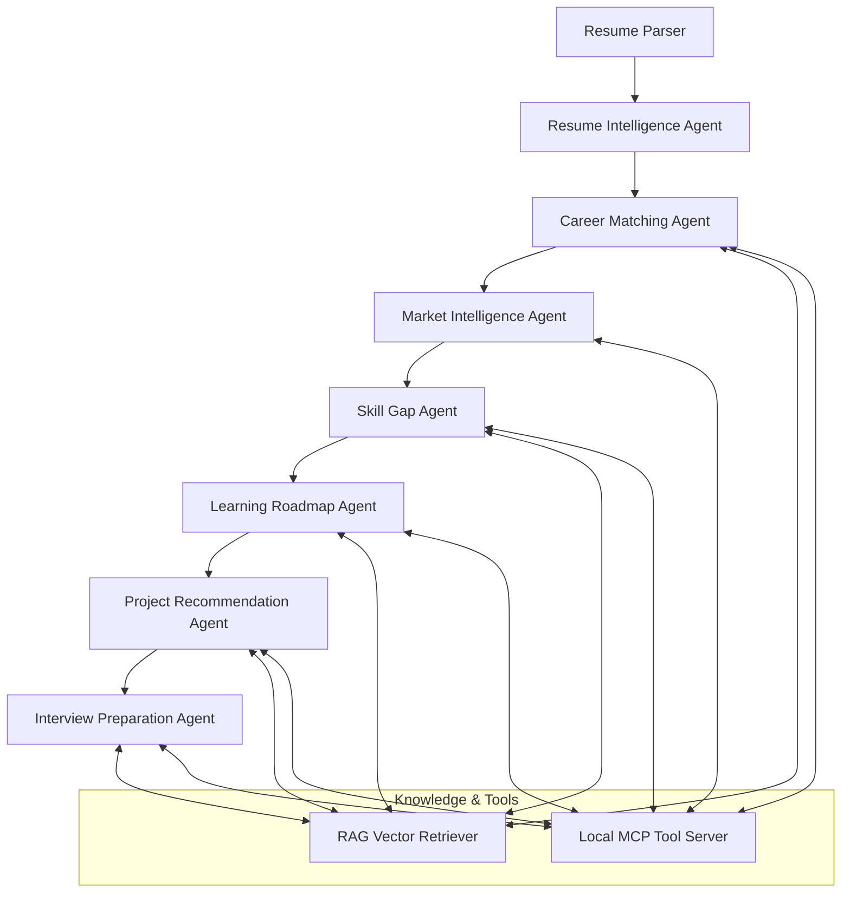

# AI Career Intelligence & Growth Platform

> **Multi-Agent + RAG + MCP + Gemini AI Career Intelligence Platform**  
> An autonomous, hardware-optimized AI career guidance system designed to analyze candidate resumes, calculate transparent heuristic career fit scores, benchmark reference market demand via local MCP tools, perform RAG-augmented skill gap priority analyses, generate personalized 6-phase learning roadmaps, blueprint portfolio projects, and prepare candidates for technical interviews with complete source provenance.

---

## 🚀 Key Architectural Differentiators

1. **Hardware-Optimized Footprint **: Designed for standard 8 GB RAM machines without requiring GPUs or heavy local LLMs. Uses lightweight scikit-learn TF-IDF LSA dense vector search and an in-process Model Context Protocol (MCP) server.
2. **Transparent Heuristic Match Scoring**: Avoids LLM hallucination of numerical metrics. Calculates deterministic Profile Fit Scores strictly in Python code using configurable weighted formulas (Skill Match 50%, Experience Match 20%, Projects 15%, Education 10%, Certifications 5%).
3. **Local RAG Subsystem (CPU Vector Store)**: Retrieves semantic reference knowledge from structured domain JSON documents (`data/knowledge/`) using LSA SVD dense embeddings (64 dimensions) with complete source metadata preservation.
4. **Local Model Context Protocol (MCP) Infrastructure**: Native, standard-compliant in-process MCP server executing local reference tools (`job_tools`, `market_tools`, `skill_tools`, `resource_tools`) with strict provenance attribution (`source: "MCP Local Reference Provider"`).
5. **Full Evidence & Provenance Traceability**: Every recommendation, roadmap phase, project blueprint, and interview rubric features expandable "Evidence & Sources" UI cards showing the exact RAG chunks and MCP tools that informed the analysis.
6. **Token & Cost Optimization Lifecycle **: Passes intermediate structured Pydantic schemas downstream and uses SHA-256 pipeline caching (`PipelineCache`) to serve re-requests instantly in under 1 ms with **0 LLM token cost**.

---

## 🤖 Multi-Agent + RAG + MCP Architecture



| Agent Name | Primary Responsibility | RAG & MCP Integration | Output Schema |
| :--- | :--- | :--- | :--- |
| **Resume Intelligence Agent** | Parses raw resume text into structured profile | Purely local & deterministic | `CandidateProfileSchema` |
| **Career Matching Agent** | Heuristic match scoring across 9 target tech roles | `job_description` RAG + `get_role_requirements` MCP | `List[CareerPathBase]` |
| **Market Intelligence Agent** | Demand metrics, tooling, & salary benchmarks | `get_market_benchmark` MCP | `List[MarketRoleDemand]` |
| **Skill Gap Agent** | Priority gap matrix & prerequisite mapping | `skill_dependency` RAG + `search_skill_dependencies` MCP | `SkillGapAnalysisResponse` |
| **Learning Roadmap Agent** | 6-Phase progressive learning plan | `learning_resource` RAG + `search_learning_resources` MCP | `LearningRoadmapResponse` |
| **Project Recommendation Agent** | 3 Progressive portfolio project blueprints | `project_blueprint` RAG + `search_jobs` MCP | `ProjectRecommendationResponse` |
| **Interview Preparation Agent** | 8 Category questions & STAR answer frameworks | `interview_bank` RAG + `search_interview_bank` MCP | `InterviewPreparationResponse` |

---

## 🛠️ Technology Stack

- **Backend Framework**: FastAPI (Async Python 3.10+)
- **Database & ORM**: SQLite / PostgreSQL with SQLAlchemy ORM
- **LLM Orchestration**: Google Gemini API (`google-genai` SDK) via `LLMService` abstraction layer
- **RAG Subsystem**: CPU TF-IDF LSA dense vector search (`scikit-learn`, `numpy`, `joblib`)
- **MCP Infrastructure**: Native in-process `LocalMCPServer` with Pydantic tool schemas
- **Data Validation**: Pydantic v2 & Pydantic-Settings
- **Frontend Dashboard**: Streamlit with custom Dark Glassmorphism CSS UI & Evidence Inspectors
- **Testing & Quality**: pytest test suite (94+ automated unit, RAG, MCP, pipeline, & e2e integration tests)

---

## ⚡ Quickstart Guide

### 1. Prerequisites & Installation

```bash
# Clone repository
git clone https://github.com/your-username/ai-career-intelligence.git
cd ai-career-intelligence

# Create & activate virtual environment
python -m venv .venv
.\.venv\Scripts\activate   # Windows (PowerShell)
# source .venv/bin/activate # macOS/Linux

# Install dependencies
pip install -r requirements.txt
```

### 2. Environment Configuration

Copy `.env.example` to `.env`:
```bash
cp .env.example .env
```

`.env` configuration parameters:
```ini
GEMINI_API_KEY=your_gemini_api_key_here
GEMINI_MODEL=gemini-2.5-flash
DEMO_MODE=true
RAG_ENABLED=true
RAG_TOP_K=5
MCP_ENABLED=true
DATABASE_URL=sqlite:///./career_intelligence.db
MAX_RESUME_SIZE_MB=10
LLM_TIMEOUT=30
LOG_LEVEL=INFO
MARKET_PROVIDER=mock
```

### 3. Launch Application (Single Command)

Launch both FastAPI backend (`http://127.0.0.1:8000`) and Streamlit frontend (`http://localhost:8501`) concurrently:
```bash
python run.py
```

### 4. Running Components Separately

**FastAPI Backend**:
```bash
uvicorn backend.main:app --host 127.0.0.1 --port 8000 --reload
```

**Streamlit Dashboard**:
```bash
streamlit run frontend/app.py
```

---

## ℹ️ DEMO_MODE & Transparency Disclaimers

> [!NOTE]
> **DEMO_MODE Explanation**: When `DEMO_MODE=true` (or when `GEMINI_API_KEY` is unset/placeholder), the application operates seamlessly using high-fidelity mock data generators and local reference knowledge. Set `DEMO_MODE=false` in `.env` to enable live Gemini API inference.

> [!IMPORTANT]
> **Transparent Heuristic Fit Score Disclaimer**: The **Profile Fit Score** metric generated by the platform represents a deterministic heuristic match score evaluating candidate skill, experience, project, and education alignment against role benchmarks. It is a **profile fit metric**, **not** an employment probability, hiring guarantee, or predictive job placement score.

> [!INFO]
> **Data Grounding Disclaimer**: Market intelligence and salary benchmark data displayed by the system are grounded in curated reference data (`data/market_reference/roles.json` and `data/knowledge/`). Local reference data is explicitly tagged as reference data and is never falsely represented as live web crawl data.

---

## 🧪 Running Automated Test Suite

Run the full automated unit, RAG, MCP, pipeline, and end-to-end integration test suite:
```bash
python -m pytest tests/ -v --tb=short
```

---

## 📚 Technical Documentation Suite

Exhaustive documentation is available in the `docs/` directory:
- [Architecture & System Design](docs/architecture.md)
- [RAG Subsystem Documentation](docs/rag.md)
- [Model Context Protocol (MCP) Manual](docs/mcp.md)
- [Autonomous Multi-Agent Specifications](docs/agents.md)
- [REST API Reference Manual](docs/api.md)
- [Database Schema & PostgreSQL Migration](docs/database.md)
- [Prompt Engineering & Guardrails](docs/prompts.md)
- [Installation & Setup Guide](docs/setup.md)
- [Developer Guidelines](docs/development.md)

---

## 📄 License
Distributed under the MIT License. See `LICENSE` for details.
