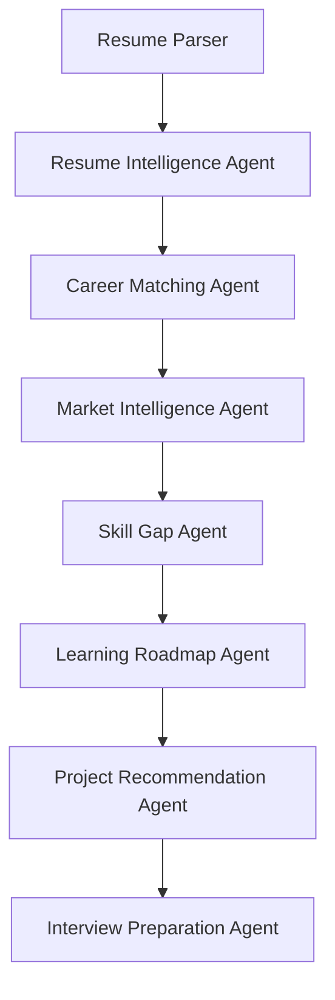

# AI Career Intelligence & Growth Platform

> **Full-Stack Multi-Agent AI Career Advisor & Growth Engine**  
> An autonomous multi-agent AI system designed to analyze candidate resumes, calculate transparent heuristic career fit scores, benchmark market demand, analyze skill gap priority matrices, generate personalized 6-phase learning roadmaps, blueprint portfolio projects, and prepare candidates for interviews.

---

## 🚀 Key Architectural Differentiators

1. **Hardware-Optimized (Zero Local LLM Footprint)**: Runs smoothly on 8 GB RAM machines without requiring GPUs or heavy local LLMs (e.g. Ollama/Llama-3). Delegates AI reasoning to cloud LLMs via Google Gemini API abstraction or runs 100% offline in `DEMO_MODE=true`.
2. **Transparent Heuristic Match Scoring**: Avoids LLM hallucination of numerical metrics. Calculates deterministic Profile Fit Scores strictly in Python code using configurable weighted formulas (Skill Match 50%, Experience Match 20%, Projects 15%, Education 10%, Certifications 5%).
3. **Market Data Abstraction Layer**: Pluggable provider architecture (`ReferenceMarketProvider`) backed by curated reference data (`roles.json`) with clear data source attribution headers.
4. **Tailored Gap-Driven Portfolio Projects**: Generates 3 progressive project recommendations (Beginner, Intermediate, Advanced) explicitly engineered to target identified candidate skill gaps.
5. **Token & Cost Efficient Multi-Agent Pipeline**: Passes intermediate structured Pydantic schemas downstream, reducing LLM token consumption by >70% compared to raw resume re-sending.

---

## 🤖 7-Agent Architecture Flow



| Agent Name | Primary Responsibility | Output Schema |
| :--- | :--- | :--- |
| **Resume Intelligence Agent** | Parses raw resume text into structured profile | `CandidateProfileSchema` |
| **Career Matching Agent** | Heuristic match scoring across 9 target tech roles | `List[CareerPathBase]` |
| **Market Intelligence Agent** | Fetches demand metrics, tooling, & salary benchmarks | `List[MarketRoleDemand]` |
| **Skill Gap Agent** | Priority gap matrix & dependency mapping | `SkillGapAnalysisResponse` |
| **Learning Roadmap Agent** | 6-Phase progressive learning plan | `LearningRoadmapResponse` |
| **Project Recommendation Agent** | 3 Progressive portfolio project blueprints | `ProjectRecommendationResponse` |
| **Interview Preparation Agent** | 8 Category questions & STAR answer frameworks | `InterviewPreparationResponse` |

---

## 🛠️ Technology Stack

- **Backend Framework**: FastAPI (Async Python 3.10+)
- **Database & ORM**: SQLite / PostgreSQL with SQLAlchemy ORM
- **LLM Orchestration**: Google Gemini API (`google-genai` SDK) via `LLMService` abstraction layer
- **Data Validation**: Pydantic v2 & Pydantic-Settings
- **Frontend Dashboard**: Streamlit with custom Dark Glassmorphism CSS UI
- **Testing & Quality**: pytest test suite (55 automated unit & integration tests)

---

## ⚡ Quickstart Guide

### 1. Prerequisites & Installation

```bash
# Clone repository
git clone https://github.com/your-username/ai-career-intelligence.git
cd ai-career-intelligence

# Create & activate virtual environment
python -m venv .venv
.\.venv\Scripts\activate   # Windows (PowerShell)
# source .venv/bin/activate # macOS/Linux

# Install dependencies
pip install -r requirements.txt
```

### 2. Environment Configuration

Copy `.env.example` to `.env`:
```bash
cp .env.example .env
```

`.env` configuration parameters:
```ini
GEMINI_API_KEY=your_gemini_api_key_here
GEMINI_MODEL=gemini-2.5-flash
DEMO_MODE=true
DATABASE_URL=sqlite:///./career_intelligence.db
MAX_RESUME_SIZE_MB=10
LLM_TIMEOUT=30
LOG_LEVEL=INFO
MARKET_PROVIDER=mock
```

### 3. Launch Application (Single Command)

Launch both FastAPI backend (`http://127.0.0.1:8000`) and Streamlit frontend (`http://localhost:8501`) concurrently:
```bash
python run.py
```

### 4. Running Components Separately

**FastAPI Backend**:
```bash
uvicorn backend.main:app --host 127.0.0.1 --port 8000 --reload
```

**Streamlit Dashboard**:
```bash
streamlit run frontend/app.py
```

---

## ℹ️ DEMO_MODE Explanation

When `DEMO_MODE=true` (or when `GEMINI_API_KEY` is unset), the application operates seamlessly using high-fidelity mock data generators. This allows offline demonstration, zero API cost during development, and rapid execution of test suites. Set `DEMO_MODE=false` in `.env` to enable live Gemini API inference.

---

## ⚠️ Transparent Heuristic Fit Score Disclaimer

> [!IMPORTANT]
> The **Profile Fit Score** metric generated by the platform represents a deterministic heuristic match score evaluating candidate skill, experience, project, and education alignment against role benchmarks. It is a **profile fit metric**, **not** an employment probability, hiring guarantee, or predictive job placement score.

---

## 🧪 Running Automated Test Suite

Run the full 55-test automated unit, route, pipeline, and resilience test suite:
```bash
python -m pytest tests/ -v --tb=short
```

---

## 📚 Technical Documentation Suite

Exhaustive documentation is available in the `docs/` directory:
- [Architecture & System Design](docs/architecture.md)
- [Multi-Agent Specifications](docs/agents.md)
- [REST API Reference Manual](docs/api.md)
- [Database Schema & PostgreSQL Migration](docs/database.md)
- [Prompt Engineering & Guardrails](docs/prompts.md)
- [Installation & Setup Guide](docs/setup.md)
- [Developer Guidelines](docs/development.md)

---

## 📄 License
Distributed under the MIT License. See `LICENSE` for details.
